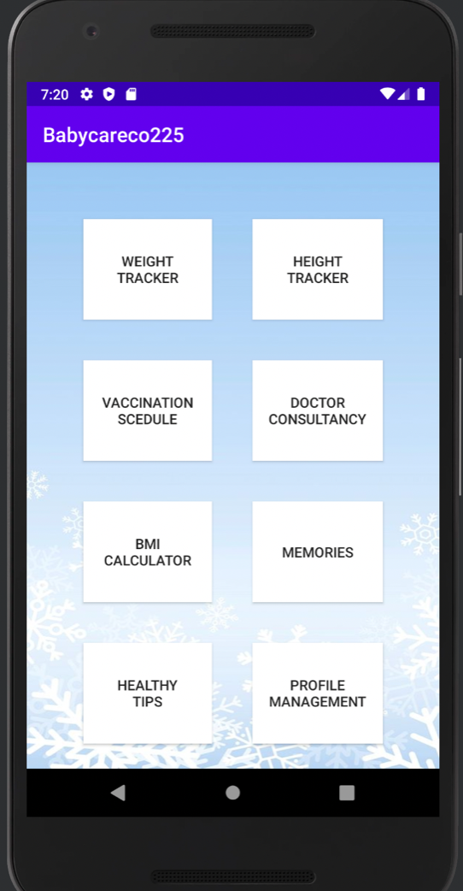

# Baby Development Tracking System

## Technologies Used

- **Android Studio**: Integrated Development Environment (IDE) for Android development.
- **Firebase**: Backend as a service, providing database, authentication, and hosting.
- **Java**: Programming language used for developing the application.

## Project Overview

This project involves building a mobile application to track and manage the development of babies aged 0 to 5 years. The application allows parents or guardians to register their babies, input their details, and track their growth and vaccination schedules.

## Features

- **User Registration**: Allows users to register their babies with details like name, birth date, gender, current weight, and height.
- **Vaccination Tracking**: Users can enter vaccination records and receive reminders for upcoming vaccinations based on a standard vaccine schedule.
- **Growth Tracking**: Users can track their babies' weight and height and compare these measurements with standard ranges for their age.

## Contribution

- **System Design**: Created the overall system architecture and user interface design.
- **Database Development**: Designed and implemented the database schema in Firebase to store user and baby information securely.
- **Backend Implementation**: Developed the backend logic using Java to handle data processing, notifications, and user authentication.

## User Interface

Here are some screenshots of the application:

  

  

  

  

  

